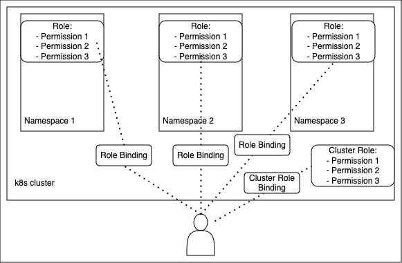

# k8s - Role based Access Control (RBAC)

In kubernetes, **_RBAC allows you to control what users are allow to do and access in your cluster_**.

For example, you can use RBAC to allow developers to read logs and metadata from a kubernetes pod but not make changes 
to them.

**Roles and ClusterRoles are objects that define a set of permissions.** These permissions determine what users can do in
k8s cluster.
---
- **Role**: define permissions within a particular namespace.
- **ClusterRole**: define cluster-wide permissions not specific to a particular namespace.
---
- **RoleBinding** and **ClusterRoleBinding** are objects that connect Roles and ClusterRoles with users.
---

Link to the official k8s documentation on RBAC [here](https://kubernetes.io/docs/reference/access-authn-authz/rbac/).